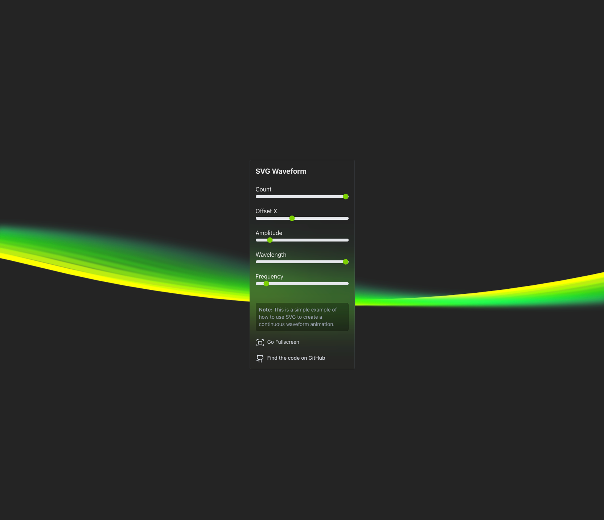

# SVG Sine Animation - Revamp

This is a fun project to revamp the original SVG Sine Animation. The goal is to provide a more structured and reusable
component for generating animated SVG curves using React.

Demo: https://svg-sine-anim-revamp.vercel.app/

[](docs/demo.mp4)

Original implementation can still be found here https://github.com/imadx/svg-sine-anim

### Run the Project Locally

```bash
pnpm install
pnpm dev
```


## SvgCurve Component

This React component generates an animated SVG curve. It utilizes quadratic Bezier curves to create a smooth, flowing
shape that can be customized through props.

eg: 
```svg
<path d="M -2000 300 q 500 0 1000 200 t 1000 0 t 1000 0 t 1000 0 t 1000 0 t 1000 0 t 1000 0 t 1000 0" fill="none" stroke="hsl(150, 100%, 50%)" stroke-width="10" stroke-linecap="round"></path>
```

Explanation of the SVG Path Commands:
- `M` - Move to the starting point
- `q` - Quadratic Bezier curve
- `t` - Smooth quadratic Bezier curve

Read more on [MDN](https://developer.mozilla.org/en-US/docs/Web/SVG/Tutorial/Paths#path_data)
